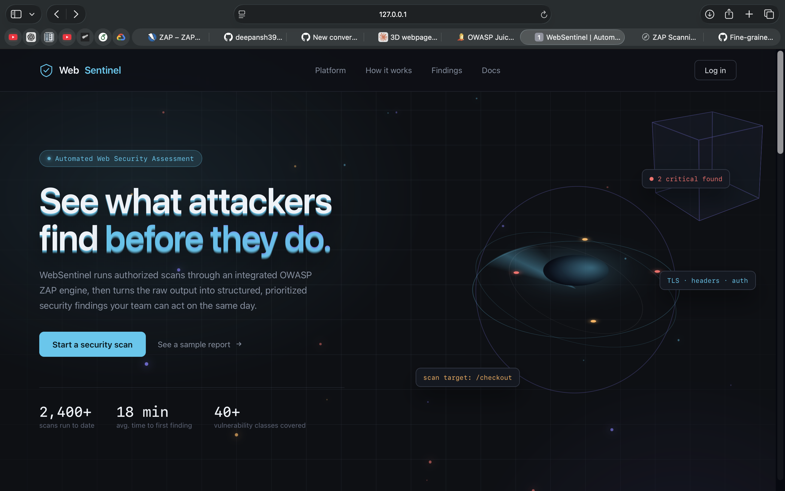

# WebSentinel
<p align="center">
  
</p>

# WebSentinel

> **Automated Web Security Assessment Platform powered by Dockerized OWASP ZAP**

WebSentinel is a Flask-based web security assessment platform that orchestrates authorized OWASP ZAP scans through Docker, collects ZAP reports, parses security alerts, normalizes findings, and presents them through a persistent web dashboard.

> **Authorized use only:** use WebSentinel only against applications and systems you own or have explicit permission to assess.

---

## Project Overview

Traditional ZAP usage often means manually preparing a target, launching a scanner command, locating generated reports, and reviewing raw output. WebSentinel adds an application layer around that workflow.

The platform provides:

- account creation and login
- authorized target submission
- background scan jobs
- scan status and progress tracking
- Dockerized OWASP ZAP execution
- JSON and HTML report collection
- ZAP JSON parsing
- normalized security findings
- severity summaries
- persistent scan history using SQLite
- a browser-based results interface

WebSentinel **does not replace ZAP's detection engine**. ZAP performs the security assessment; WebSentinel handles orchestration, report processing, persistence, and presentation.

---

## Objectives

1. Automate authorized web security assessments through a browser.
2. Isolate the scanning engine from the Flask application using Docker.
3. Make scan state visible instead of requiring terminal monitoring.
4. Convert raw ZAP output into application-level findings.
5. Preserve scan metadata and history using SQLite.
6. Provide a clean, portfolio-ready interface for reviewing security results.

---

## Core Architecture

```text
Browser
  |
  v
Flask Web App
  |
  +--------------------+
  |                    |
  v                    v
Authentication      Scan Manager
  |                    |
  |                    v
  |               scanner/zap.py
  |                    |
  |                    v
  |                 Docker
  |                    |
  |                    v
  |              OWASP ZAP
  |                    |
  |             +------+------+
  |             |             |
  |             v             v
  |          JSON Report   HTML Report
  |             |
  |             v
  |       scanner/parser.py
  |             |
  |             v
  |      Normalized Findings
  |             |
  +-------------+-------------+
                |
                v
          SQLite + Dashboard
```

---

## End-to-End Scan Flow

```text
1. User signs up or logs in
2. User opens the dashboard
3. User enters an authorized target URL
4. Flask creates a unique scan ID
5. Scan Manager starts a background job
6. scanner/zap.py builds the Docker/ZAP command
7. Docker starts a disposable ZAP container
8. zap-full-scan.py receives the target with -t
9. ZAP performs the assessment
10. ZAP writes JSON and HTML reports
11. WebSentinel verifies/collects the reports
12. parser.py reads the JSON report
13. ZAP alerts are normalized into finding objects
14. Results are displayed in the dashboard
15. Scan metadata is available through scan history
```

---

## Features

### Authentication

- Signup
- Login
- Logout
- Session-based access control
- Password hashing with PBKDF2-SHA256
- Duplicate-email detection
- Password confirmation
- Login and registration error handling

### Scan Management

- URL target submission
- Target validation
- UUID scan identifiers
- Background execution
- QUEUED / STARTING / RUNNING / COLLECTING / COMPLETE / FAILED states
- Application-level progress tracking

### Scanner Integration

- Official OWASP ZAP Docker image
- `zap-full-scan.py` execution
- Dynamic target passing
- JSON report generation
- HTML report generation
- Host-to-container report volume mapping

### Report Processing

- JSON report loading
- ZAP site/alert extraction
- Severity mapping
- Confidence extraction
- URL and parameter extraction
- Evidence extraction
- CWE extraction
- normalized findings

### Dashboard and Results

- Cybersecurity-themed dashboard
- Scan history
- Status and progress
- Severity summary
- Detailed finding table
- Target information
- ZAP report access

### Persistence

- SQLite users table
- SQLite scan records
- timestamps
- report paths
- scan status metadata

---

## Technology Stack

| Layer | Technology | Purpose |
|---|---|---|
| Backend | Python | Application logic |
| Web | Flask | Routes, sessions, templates |
| Templating | Jinja2 | Dynamic HTML |
| Security Engine | OWASP ZAP | Web application scanning |
| Runtime Isolation | Docker | ZAP execution environment |
| Storage | SQLite | Users and scan metadata |
| Frontend | HTML/CSS/JavaScript | Dashboard and interaction |
| UI Typography | IBM Plex | Interface style |

---

## Project Structure

```text
websentinel/
├── app.py
├── database.py
├── requirements.txt
├── README.md
├── .gitignore
│
├── scanner/
│   ├── __init__.py
│   ├── zap.py
│   ├── scan_manager.py
│   └── parser.py
│
├── templates/
│   ├── index.html
│   ├── login.html
│   ├── signup.html
│   ├── dashboard.html
│   ├── scan_status.html
│   └── results.html
│
├── static/
│   ├── assets/
│   ├── css/
│   └── js/
│
├── reports/
│   └── .gitkeep
│
└── screenshots/
```

### Component responsibilities

**`app.py`** — Flask routes, authentication flow, dashboard, scan endpoints, result rendering, and report access.

**`database.py`** — SQLite initialization, user records, scan records, history queries, and updates.

**`scanner/zap.py`** — target validation, Docker discovery, ZAP command construction, report directory handling, and report existence checks.

**`scanner/scan_manager.py`** — scan IDs, background execution, state transitions, and coordination between ZAP and persistence.

**`scanner/parser.py`** — ZAP JSON parsing and normalization of alerts into application-level finding objects.

**`templates/`** — landing, authentication, dashboard, scan-status, and results interfaces.

**`reports/`** — local generated scanner reports. Generated files are ignored by Git.

---

# Docker

## Why Docker is used

Docker keeps the scanner runtime separate from the Flask environment.

Benefits include:

- isolation of ZAP from the Python application
- reproducible scanner runtime
- no need to install ZAP and its Java runtime into the Python virtual environment
- disposable scanner containers
- simple report volume mapping
- easier local lab setup

The responsibilities are deliberately separated:

```text
Flask        = application layer
Scan Manager = job orchestration
Docker       = runtime isolation
ZAP          = detection/scanning engine
Parser       = report interpretation
SQLite       = application persistence
```

---

## Docker Requirements

Install Docker Desktop and make sure the Docker daemon is running.

Check Docker:

```bash
docker --version
docker ps
```

The WebSentinel development environment can also locate the Docker CLI under `~/.docker/bin/docker` on macOS when it is not already on PATH.

---

## OWASP ZAP Image

WebSentinel uses the official stable ZAP image:

```text
ghcr.io/zaproxy/zaproxy:stable
```

Pull it manually:

```bash
docker pull ghcr.io/zaproxy/zaproxy:stable
```

Verify it:

```bash
docker run --rm \
  ghcr.io/zaproxy/zaproxy:stable \
  zap.sh -version
```

The development environment was verified with ZAP 2.17.0.

---

## Understanding the ZAP Docker Command

A simplified WebSentinel scan command looks like:

```bash
docker run --rm \
  -v "/absolute/path/to/websentinel/reports:/zap/wrk/:rw" \
  -t \
  ghcr.io/zaproxy/zaproxy:stable \
  zap-full-scan.py \
  -t http://target.example \
  -J /zap/wrk/findings.json \
  -r /zap/wrk/report.html \
  -I
```

### `docker run`
Starts a new container.

### `--rm`
Removes the temporary container after the scan exits.

### `-v`
Mounts the host `reports/` directory into the container as `/zap/wrk/`.

This is what allows files created inside the container to remain available on the host after the container is removed.

### `-t`
Allocates a pseudo-terminal for the command.

### `zap-full-scan.py`
Invokes ZAP's full-scan script.

### `-t <target>`
Supplies the target that ZAP should scan.

### `-J <path>`
Writes a JSON report.

### `-r <path>`
Writes an HTML report.

### `-I`
Runs with the configured handling for informational results rather than treating informational findings as a fatal condition.

---

## How WebSentinel Supplies the Target

The URL entered in the dashboard becomes the value passed to ZAP's `-t` option.

Example:

```text
Dashboard input
    ↓
http://host.docker.internal:3000
    ↓
Flask POST /scan
    ↓
create_scan(target)
    ↓
run_zap_scan(target)
    ↓
zap-full-scan.py -t http://host.docker.internal:3000
```

WebSentinel therefore does not use a fixed scan target. The target is supplied dynamically by the application.

---

# Local Vulnerable Lab: OWASP Juice Shop

For development and portfolio demonstrations, an intentionally vulnerable local application is recommended.

## Start Juice Shop

```bash
docker run -d \
  --name juice-shop \
  -p 3000:3000 \
  bkimminich/juice-shop
```

Check:

```bash
docker ps
```

Open in the host browser:

```text
http://localhost:3000
```

For the ZAP container to reach the host-published service on the development Mac, use:

```text
http://host.docker.internal:3000
```

Stop:

```bash
docker stop juice-shop
```

Remove:

```bash
docker rm juice-shop
```

---

## Why `host.docker.internal` instead of `localhost`?

Inside the ZAP container, `localhost` refers to the ZAP container itself.

It does not refer to the host machine where the Juice Shop port is published.

For the local Docker test setup:

```text
Host Mac
  |
  +-- Juice Shop :3000
  |
  +-- ZAP container
         |
         +-- host.docker.internal:3000
```

This is a development/lab networking choice. Other deployment environments may need a different target networking model.

---

# Installation

## 1. Clone the repository

```bash
git clone <YOUR-GITHUB-REPOSITORY-URL>
cd websentinel
```

## 2. Create a Python virtual environment

```bash
python3 -m venv .venv
```

## 3. Activate it

```bash
source .venv/bin/activate
```

Verify:

```bash
which python
```

It should point to the WebSentinel environment, for example:

```text
.../websentinel/.venv/bin/python
```

## 4. Install Python dependencies

```bash
pip install -r requirements.txt
```

## 5. Start Docker

```bash
docker ps
```

## 6. Pull ZAP

```bash
docker pull ghcr.io/zaproxy/zaproxy:stable
```

## 7. Start WebSentinel

```bash
python app.py
```

Open:

```text
http://127.0.0.1:5000
```

---

# Python Dependencies

Current direct application dependencies:

```text
Flask==3.1.3
Werkzeug==3.1.8
```

Install with:

```bash
pip install -r requirements.txt
```

Docker and OWASP ZAP are runtime dependencies, not Python packages, so they are not placed in `requirements.txt`.

---

# Authentication Workflow

```text
/signup
   ↓
Validate name/email/password
   ↓
PBKDF2-SHA256 password hash
   ↓
SQLite users table
   ↓
/login
   ↓
Password verification
   ↓
Flask session
   ↓
/dashboard
```

Users are not stored with plaintext passwords.

The current implementation is intended for local development and portfolio demonstration. Production deployments require additional authentication hardening.

---

# Scan Lifecycle

WebSentinel tracks scan jobs using application-level states:

```text
QUEUED
   ↓
STARTING
   ↓
RUNNING
   ↓
COLLECTING
   ↓
COMPLETE
```

Failure path:

```text
STARTING / RUNNING / COLLECTING
            ↓
         FAILED
```

The displayed progress represents the WebSentinel workflow stages. It is not a precise internal ZAP percentage.

---

# Report Pipeline

ZAP produces two primary files:

```text
JSON  → machine-readable data for WebSentinel
HTML  → original human-readable ZAP report
```

Typical file flow:

```text
ZAP container
    ↓
/zap/wrk/
    ↓
Host reports/
    ↓
scanner/parser.py
    ↓
normalized findings
    ↓
results.html
```

Example manual report test:

```bash
docker run --rm \
  -v "/absolute/path/to/websentinel/reports:/zap/wrk/:rw" \
  -t \
  ghcr.io/zaproxy/zaproxy:stable \
  zap-full-scan.py \
  -t http://host.docker.internal:3000 \
  -J /zap/wrk/test_findings.json \
  -r /zap/wrk/test_report.html \
  -I
```

Then verify:

```bash
ls -lah reports/
```

Expected:

```text
test_findings.json
test_report.html
```

Inspect JSON:

```bash
head -c 3000 reports/test_findings.json
```

Or format it:

```bash
python -m json.tool reports/test_findings.json
```

---

# Finding Normalization

WebSentinel transforms ZAP alerts into a stable application-level representation.

Conceptually:

```text
id
name
severity
confidence
url
parameter
evidence
cwe
owasp_category
```

The frontend can therefore consume a consistent structure without exposing all of the raw ZAP report structure directly.

---

# Severity Mapping

Current risk-code mapping:

| ZAP Risk Code | WebSentinel Severity |
|---:|---|
| 3 | Critical |
| 2 | High |
| 1 | Medium |
| 0 | Informational |

The UI uses these normalized categories for summary cards and result rows.

---

# Scan History and SQLite

The application creates a local SQLite database named:

```text
websentinel.db
```

## Users table

Stores account information such as:

```text
id
name
email
password_hash
created_at
```

## Scans table

Stores scan metadata such as:

```text
id
target
status
stage
progress
created_at
started_at
finished_at
json_report
html_report
error
```

The database is development state and is intentionally ignored by Git.

---

# Results Dashboard

The result interface presents normalized scanner findings using:

- total finding count
- Critical count
- High count
- Medium count
- Low count
- Informational count
- finding name
- ZAP ID
- severity
- confidence
- parameter
- URL

The purpose of the Results page is to make raw scanner output easier to inspect.

---

# Report Access

WebSentinel can expose the generated JSON and HTML reports for a completed scan.

Report access is tied to the scan identifier so that the application can resolve the report associated with the specific assessment.

---

# Useful Development Commands

## Activate environment

```bash
source .venv/bin/activate
```

## Verify Python

```bash
which python
python --version
```

## Verify installed dependencies

```bash
pip freeze
```

## Start Flask

```bash
python app.py
```

## Check Docker

```bash
docker version
docker ps
```

## Check ZAP

```bash
docker run --rm \
  ghcr.io/zaproxy/zaproxy:stable \
  zap.sh -version
```

## Inspect generated reports

```bash
ls -lah reports/
```

## Check Python syntax

```bash
python -m py_compile app.py
python -m py_compile database.py
python -m py_compile scanner/zap.py
python -m py_compile scanner/parser.py
python -m py_compile scanner/scan_manager.py
```

---

# Troubleshooting

## `docker: command not found`

Check:

```bash
which docker
```

Make sure Docker Desktop is installed and running. On the development Mac, Docker CLI may also be available under:

```text
~/.docker/bin/docker
```

## `TemplateNotFound`

Check the template directory:

```bash
ls -la templates/
```

The required templates must exist under `templates/`.

## ZAP reports are missing

Check:

```bash
ls -lah reports/
```

If the directory is empty, run the ZAP Docker command manually. This separates scanner problems from WebSentinel integration problems.

## Report exists manually but not through WebSentinel

Inspect `scanner/zap.py` and verify the report directory is anchored to the WebSentinel project path, not to an arbitrary current working directory.

## Wrong Python environment

Run:

```bash
which python
```

Use the WebSentinel virtual environment rather than another project's environment.

## Juice Shop is unreachable from ZAP

For the local Docker lab, use:

```text
http://host.docker.internal:3000
```

rather than `localhost:3000` from inside the ZAP container.

---

# Security Considerations

WebSentinel is a security assessment tool and should be operated with appropriate controls.

### Authorized targets only

Only assess systems you own or have explicit authorization to test.

### Secrets

Production secrets should not be stored directly in source code. Use environment variables or a dedicated secrets manager.

### Sessions

A production deployment should use secure cookie settings, appropriate session lifetimes, and robust session management.

### CSRF

Production state-changing forms should use CSRF protection.

### Target restrictions

A production deployment should consider target allowlists, network restrictions, scan concurrency limits, timeouts, and resource controls.

### HTTPS

Use HTTPS in production.

---

# Safe Testing

Recommended local test target:

```text
OWASP Juice Shop
```

Example target for this Docker-based development setup:

```text
http://host.docker.internal:3000
```

Do not use the project to probe unauthorized third-party applications.

---

# Testing Checklist

Before publishing a release, verify:

```text
[ ] Python environment works
[ ] Flask starts
[ ] Docker is running
[ ] ZAP image is available
[ ] Signup works
[ ] Login works
[ ] Dashboard loads
[ ] Authorized target can be submitted
[ ] Scan status page appears
[ ] ZAP scan completes
[ ] JSON report exists
[ ] HTML report exists
[ ] Parser returns findings
[ ] Results page displays findings
[ ] Scan appears in history
[ ] Reports can be accessed
```

---

# Git Hygiene

The Git repository should not contain:

```text
.venv/
websentinel.db
.env
Generated ZAP reports
__pycache__/
.DS_Store
IDE-specific files
```

The repository should contain source code, documentation, and selected screenshots rather than generated local assessment data.

---

# Current Project Status

**WebSentinel — Functional Portfolio MVP**

Core implementation status:

```text
Authentication                    ✅
Signup / Login                    ✅
Dashboard                         ✅
Scan creation                     ✅
Background scan management        ✅
Docker integration                ✅
OWASP ZAP integration             ✅
JSON report generation            ✅
HTML report generation            ✅
ZAP result parsing                ✅
Finding normalization             ✅
Results dashboard                 ✅
Scan history                      ✅
SQLite persistence                ✅
Report access                     ✅
```

---

# Limitations

The current project is a practical portfolio MVP rather than an enterprise vulnerability-management platform.

Current limitations include:

- local SQLite storage
- in-memory active scan job state
- development-oriented authentication
- no enterprise RBAC
- no distributed job queue
- no multi-node scan workers
- no production secret-management layer
- no long-term report retention service

These are appropriate areas for future versions.

---

# Future Improvements

Potential future extensions include:

- persistent reconstruction of historical findings
- finding deduplication/grouping
- detailed finding views
- scan cancellation
- concurrent scan limits
- target allowlists
- scheduled scans
- notifications
- API access
- advanced filtering and search
- role-based access control
- Redis/Celery worker architecture
- production deployment support

---

# Screenshots

Place project screenshots under:

```text
screenshots/
```

Recommended documentation screenshots:

```text
landing.png
login.png
signup.png
dashboard.png
scan-status.png
results.png
scan-history.png
```

Example Markdown:

```markdown

```

---

# Miscellaneous Notes

- `requirements.txt` contains Python dependencies only.
- Docker is an infrastructure/runtime dependency, not a Python package.
- OWASP ZAP is the detection engine; WebSentinel is the application/orchestration layer.
- Generated reports belong in local `reports/` and should normally remain outside Git.
- `websentinel.db` is local development state and should remain outside Git.
- `host.docker.internal` is mainly relevant to the local Docker-based lab workflow.
- Start Docker before starting scans.
- Launch Flask from the WebSentinel virtual environment.
- Use intentionally vulnerable labs such as Juice Shop for reproducible demonstrations.

---

# License

Add the license selected for this repository before publishing it publicly.

---

## WebSentinel

**Dockerized OWASP ZAP Web Security Assessment Platform**

A practical cybersecurity engineering project demonstrating web application development, authentication, Docker orchestration, security automation, scanner report processing, persistence, and security findings visualization.
